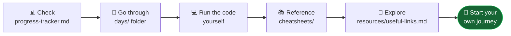

# 🤝 Contributing & Using This Repo

Hi! Thanks for visiting my AI/ML Learning Journey! 👋

<p align="center">
  
  
  
</p>

---

## 👀 For Visitors & Fellow Learners

| Action | Why |
|---|---|
| ⭐ **Star this repo** | Follow along, keeps me motivated too |
| 🍴 **Fork it** | Start your own journey using this structure |
| 💬 **Open a Discussion** | Share your progress or ask questions |
| 🐛 **Open an Issue** | Spot a mistake in my notes or code? Flag it |
| 💼 **Connect on [LinkedIn](https://www.linkedin.com/in/bala-ravi444/)** | Let's learn in public together |

---

## 🗺️ How to Use This Repo for Your Own Learning



1. Check the **[Progress Tracker](progress-tracker.md)** for the full roadmap
2. Go through each day's notes in the **`days/`** folder
3. Study the code files and try running them yourself
4. Use the **`cheatsheets/`** folder for quick reference
5. Check **`resources/useful-links.md`** for learning resources

---

## 🐛 Reporting an Issue

Found a bug in code, a typo in notes, or a broken link? Open an issue with:

```
**Where:** days/Phase-04-Machine-Learning/day-53/code
**What's wrong:** Logistic regression example throws a shape error
**Expected:** Should run without error on the sample dataset
```

## 🔧 Submitting a Pull Request

1. Fork the repo
2. Create a branch: `git checkout -b fix/day-53-typo`
3. Make your change
4. Commit: `git commit -m "fix: correct typo in day 53 notes"`
5. Push and open a PR — describe what changed and why

Good first PRs: fixing typos, broken links, adding a missing cheatsheet entry, improving code comments.

---

## 📌 Repo Structure

```
AI-ML-Learning-Journey/
├── assets/                        ← banner & visual assets
│   ├── banner.svg
│   └── progress.svg
├── days/                          ← daily notes + code, by phase
│   ├── Phase-01-Python-Foundations/
│   ├── Phase-02-DSA-ArthAI/
│   ├── Phase-03-Data-Science/
│   ├── Phase-04-Machine-Learning/
│   └── Phase-05-Deep-Learning-AI/
├── projects/                      ← live & built projects
│   ├── 01_ai_learning_management_system/
│   ├── arthAI/
│   └── indian_job_market_analyzer/
├── cheatsheets/                   ← quick-reference sheets
│   ├── python-cheatsheet.md
│   ├── dsa-cheatsheet.md
│   ├── pandas-numpy-cheatsheet.md
│   ├── machine-learning-cheatsheet.md
│   └── git-sql-cheatsheet.md
├── resources/
│   └── useful-links.md
├── progress-tracker.md            ← full roadmap + status
├── README.md
└── CONTRIBUTING.md                ← this file
```

---

## 🙏 A Note

This is a personal learning-in-public repo — not a production library — so contributions are welcome but the main content stays true to my own daily learning. Corrections, resource suggestions, and encouragement are always appreciated. 🔥

<p align="center"><i>Building in public, one day at a time.</i></p>
