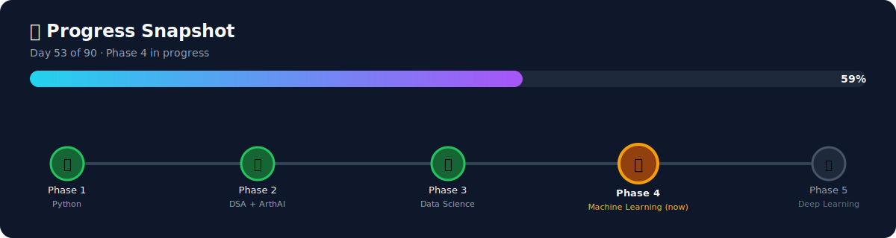
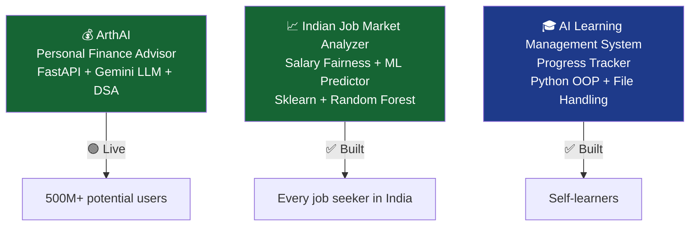
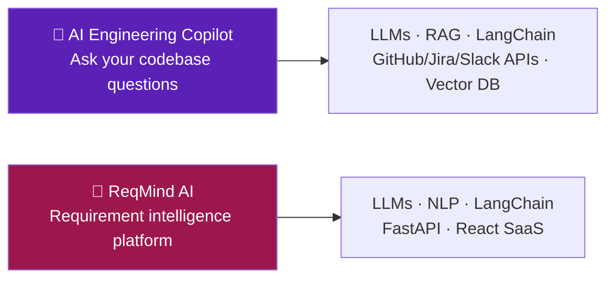

<p align="center">
  
</p>

<h1 align="center">🚀 AI/ML Learning Journey — Bala Ravi</h1>

<p align="center"><b>90 days. 0 days missed. AI Engineer by November 2026.</b></p>

<p align="center">
  
  
  
  
  
</p>

<p align="center">
  <a href="https://github.com/balaravi444"></a>
  <a href="https://linkedin.com/in/bala-ravi444"></a>
  <a href="https://twitter.com/balaravi444"></a>
  <a href="https://leetcode.com/balaravi4545"></a>
</p>

**👨‍💻 Bala Ravi** — BCA Student, The Oxford College of Science, Bangalore University

---

## 🎯 Goal

Become an **AI Engineer** by November 2026 — starting from Python basics, building real products, solving real problems, deploying real apps.

> No toy datasets. No tutorial clones. Real products that real people use.

---

## 📊 Progress Snapshot

<p align="center">
  
</p>

**53 / 90 days done — 59% complete, on track for November 2026.**

---

## 🏗️ Live Projects



| # | Project | What It Does | Tech | Status |
|---|---|---|---|---|
| 1 | **[ArthAI](projects/arthAI)** | AI-powered personal finance advisor for every Indian | FastAPI, Gemini LLM, DSA (DP + Binary Search) | 🟢 Live |
| 2 | **[Indian Job Market Analyzer](projects/indian_job_market_analyzer)** | Salary fairness checker + ML salary predictor for Indian AI/ML jobs | Pandas, Sklearn, Random Forest, FastAPI, Chart.js | 🟢 Live |
| 3 | **[AI Learning Management System](projects/01_ai_learning_management_system)** | Track and manage AI/ML learning progress | Python OOP, File Handling | ✅ Built |

---

## 🗺️ Roadmap Overview

| Phase | Focus | Days | Status |
|---|---|---|---|
| 🐍 **Phase 1** | Python Foundations | Day 01–20 | ✅ Complete |
| 🔢 **Phase 2** | DSA + ArthAI (Fintech App) | Day 21–35 | ✅ Complete |
| 📊 **Phase 3** | Data Science + Job Market Analyzer | Day 36–50 | ✅ Complete |
| 🤖 **Phase 4** | Machine Learning + 2 Projects | Day 51–70 | ⏳ Day 53/70 |
| 🧠 **Phase 5** | Deep Learning + AI + 3 Projects | Day 71–90 | 🔒 Pending |
| 🚀 **Phase 6** | Enterprise AI Products | Day 90+ | 🔒 Planned |

---

## 📋 Daily Progress Log

<details>
<summary><b>🐍 Phase 1 — Python Foundations ✅ (Day 01–20) — click to expand</b></summary>

| Day | Topic | Notes | Code |
|---|---|---|---|
| Day 01 | Python Basics — Variables, I/O | [📝 Notes](days/Phase-01-Python-Foundations/day-01/notes.md) | [💻 Code](days/Phase-01-Python-Foundations/day-01/code) |
| Day 02 | Data Types & Operators | [📝 Notes](days/Phase-01-Python-Foundations/day-02/notes.md) | [💻 Code](days/Phase-01-Python-Foundations/day-02/code) |
| Day 03 | Control Flow | [📝 Notes](days/Phase-01-Python-Foundations/day-03/notes.md) | [💻 Code](days/Phase-01-Python-Foundations/day-03/code) |
| Day 04 | Functions & Variable Scope | [📝 Notes](days/Phase-01-Python-Foundations/day-04/notes.md) | [💻 Code](days/Phase-01-Python-Foundations/day-04/code) |
| Day 05 | Advanced Functions, Lambda, Recursion | [📝 Notes](days/Phase-01-Python-Foundations/day-05/notes.md) | [💻 Code](days/Phase-01-Python-Foundations/day-05/code) |
| Day 06 | Data Structures | [📝 Notes](days/Phase-01-Python-Foundations/day-06/notes.md) | [💻 Code](days/Phase-01-Python-Foundations/day-06/code) |
| Day 07 | Sets, Arrays & List Comprehensions | [📝 Notes](days/Phase-01-Python-Foundations/day-07/notes.md) | [💻 Code](days/Phase-01-Python-Foundations/day-07/code) |
| Day 08 | Collections Module | [📝 Notes](days/Phase-01-Python-Foundations/day-08/notes.md) | [💻 Code](days/Phase-01-Python-Foundations/day-08/code) |
| Day 09 | Exception Handling | [📝 Notes](days/Phase-01-Python-Foundations/day-09/notes.md) | [💻 Code](days/Phase-01-Python-Foundations/day-09/code) |
| Day 10 | File Handling | [📝 Notes](days/Phase-01-Python-Foundations/day-10/notes.md) | [💻 Code](days/Phase-01-Python-Foundations/day-10/code) |
| Day 11 | OOP — Classes & Inheritance | [📝 Notes](days/Phase-01-Python-Foundations/day-11/notes.md) | [💻 Code](days/Phase-01-Python-Foundations/day-11/code) |
| Day 12 | OOP — Encapsulation, Polymorphism | [📝 Notes](days/Phase-01-Python-Foundations/day-12/notes.md) | [💻 Code](days/Phase-01-Python-Foundations/day-12/code) |
| Day 13 | Project 1 — AI Learning Management System | [📝 Notes](days/Phase-01-Python-Foundations/day-13/notes.md) | [💻 Code](days/Phase-01-Python-Foundations/day-13/code) |
| Day 14 | Modules, Packages & Virtual Environments | [📝 Notes](days/Phase-01-Python-Foundations/day-14/notes.md) | [💻 Code](days/Phase-01-Python-Foundations/day-14/code) |
| Day 15 | Regular Expressions & NLP Preprocessing | [📝 Notes](days/Phase-01-Python-Foundations/day-15/notes.md) | [💻 Code](days/Phase-01-Python-Foundations/day-15/code) |
| Day 16 | JSON & CSV Files | [📝 Notes](days/Phase-01-Python-Foundations/day-16/notes.md) | [💻 Code](days/Phase-01-Python-Foundations/day-16/code) |
| Day 17 | Python APIs | [📝 Notes](days/Phase-01-Python-Foundations/day-17/notes.md) | [💻 Code](days/Phase-01-Python-Foundations/day-17/code) |
| Day 18 | Magic Methods & Operator Overloading | [📝 Notes](days/Phase-01-Python-Foundations/day-18/notes.md) | [💻 Code](days/Phase-01-Python-Foundations/day-18/code) |
| Day 19 | Decorators & Generators | [📝 Notes](days/Phase-01-Python-Foundations/day-19/notes.md) | [💻 Code](days/Phase-01-Python-Foundations/day-19/code) |
| Day 20 | Python Revision + LeetCode | [📝 Notes](days/Phase-01-Python-Foundations/day-20/notes.md) | [💻 Code](days/Phase-01-Python-Foundations/day-20/code) |

</details>

<details>
<summary><b>🔢 Phase 2 — DSA + ArthAI ✅ (Day 21–35) — click to expand</b></summary>

| Day | Topic | Notes | Code |
|---|---|---|---|
| Day 21 | DSA + ArthAI | [📝 Notes](days/Phase-02-DSA-ArthAI/day-21/notes.md) | [💻 Code](days/Phase-02-DSA-ArthAI/day-21/code) |
| Day 22 | DSA + ArthAI | [📝 Notes](days/Phase-02-DSA-ArthAI/day-22/notes.md) | [💻 Code](days/Phase-02-DSA-ArthAI/day-22/code) |
| Day 23 | DSA + ArthAI | [📝 Notes](days/Phase-02-DSA-ArthAI/day-23/notes.md) | [💻 Code](days/Phase-02-DSA-ArthAI/day-23/code) |
| Day 24 | DSA + ArthAI | [📝 Notes](days/Phase-02-DSA-ArthAI/day-24/notes.md) | [💻 Code](days/Phase-02-DSA-ArthAI/day-24/code) |
| Day 25 | DSA + ArthAI | [📝 Notes](days/Phase-02-DSA-ArthAI/day-25/notes.md) | [💻 Code](days/Phase-02-DSA-ArthAI/day-25/code) |
| Day 26 | DSA + ArthAI | [📝 Notes](days/Phase-02-DSA-ArthAI/day-26/notes.md) | [💻 Code](days/Phase-02-DSA-ArthAI/day-26/code) |
| Day 27 | DSA + ArthAI | [📝 Notes](days/Phase-02-DSA-ArthAI/day-27/notes.md) | [💻 Code](days/Phase-02-DSA-ArthAI/day-27/code) |
| Day 28 | DSA + ArthAI | [📝 Notes](days/Phase-02-DSA-ArthAI/day-28/notes.md) | [💻 Code](days/Phase-02-DSA-ArthAI/day-28/code) |
| Day 29 | DSA + ArthAI | [📝 Notes](days/Phase-02-DSA-ArthAI/day-29/notes.md) | [💻 Code](days/Phase-02-DSA-ArthAI/day-29/code) |
| Day 30 | DSA + ArthAI | [📝 Notes](days/Phase-02-DSA-ArthAI/day-30/notes.md) | [💻 Code](days/Phase-02-DSA-ArthAI/day-30/code) |
| Day 31 | DSA + ArthAI | [📝 Notes](days/Phase-02-DSA-ArthAI/day-31/notes.md) | [💻 Code](days/Phase-02-DSA-ArthAI/day-31/code) |
| Day 32 | DSA + ArthAI | [📝 Notes](days/Phase-02-DSA-ArthAI/day-32/notes.md) | [💻 Code](days/Phase-02-DSA-ArthAI/day-32/code) |
| Day 33 | DSA + ArthAI | [📝 Notes](days/Phase-02-DSA-ArthAI/day-33/notes.md) | [💻 Code](days/Phase-02-DSA-ArthAI/day-33/code) |
| Day 34 | DSA + ArthAI | [📝 Notes](days/Phase-02-DSA-ArthAI/day-34/notes.md) | [💻 Code](days/Phase-02-DSA-ArthAI/day-34/code) |
| Day 35 | DSA + ArthAI | [📝 Notes](days/Phase-02-DSA-ArthAI/day-35/notes.md) | [💻 Code](days/Phase-02-DSA-ArthAI/day-35/code) |

</details>

<details>
<summary><b>📊 Phase 3 — Data Science ✅ (Day 36–50) — click to expand</b></summary>

| Day | Topic | Notes | Code |
|---|---|---|---|
| Day 36 | Data Science + Job Market Analyzer | [📝 Notes](days/Phase-03-Data-Science/day-36/notes.md) | [💻 Code](days/Phase-03-Data-Science/day-36/code) |
| Day 37 | Data Science + Job Market Analyzer | [📝 Notes](days/Phase-03-Data-Science/day-37/notes.md) | [💻 Code](days/Phase-03-Data-Science/day-37/code) |
| Day 38 | Data Science + Job Market Analyzer | [📝 Notes](days/Phase-03-Data-Science/day-38/notes.md) | [💻 Code](days/Phase-03-Data-Science/day-38/code) |
| Day 39 | Data Science + Job Market Analyzer | [📝 Notes](days/Phase-03-Data-Science/day-39/notes.md) | [💻 Code](days/Phase-03-Data-Science/day-39/code) |
| Day 40 | Data Science + Job Market Analyzer | [📝 Notes](days/Phase-03-Data-Science/day-40/notes.md) | [💻 Code](days/Phase-03-Data-Science/day-40/code) |
| Day 41 | Data Science + Job Market Analyzer | [📝 Notes](days/Phase-03-Data-Science/day-41/notes.md) | [💻 Code](days/Phase-03-Data-Science/day-41/code) |
| Day 42 | Data Science + Job Market Analyzer | [📝 Notes](days/Phase-03-Data-Science/day-42/notes.md) | [💻 Code](days/Phase-03-Data-Science/day-42/code) |
| Day 43 | Data Science + Job Market Analyzer | [📝 Notes](days/Phase-03-Data-Science/day-43/notes.md) | [💻 Code](days/Phase-03-Data-Science/day-43/code) |
| Day 44 | Data Science + Job Market Analyzer | [📝 Notes](days/Phase-03-Data-Science/day-44/notes.md) | [💻 Code](days/Phase-03-Data-Science/day-44/code) |
| Day 45 | Data Science + Job Market Analyzer | [📝 Notes](days/Phase-03-Data-Science/day-45/notes.md) | [💻 Code](days/Phase-03-Data-Science/day-45/code) |
| Day 46 | Data Science + Job Market Analyzer | [📝 Notes](days/Phase-03-Data-Science/day-46/notes.md) | [💻 Code](days/Phase-03-Data-Science/day-46/code) |
| Day 47 | Data Science + Job Market Analyzer | [📝 Notes](days/Phase-03-Data-Science/day-47/notes.md) | [💻 Code](days/Phase-03-Data-Science/day-47/code) |
| Day 48 | Data Science + Job Market Analyzer | [📝 Notes](days/Phase-03-Data-Science/day-48/notes.md) | [💻 Code](days/Phase-03-Data-Science/day-48/code) |
| Day 49 | Data Science + Job Market Analyzer | [📝 Notes](days/Phase-03-Data-Science/day-49/notes.md) | [💻 Code](days/Phase-03-Data-Science/day-49/code) |
| Day 50 | Data Science + Job Market Analyzer | [📝 Notes](days/Phase-03-Data-Science/day-50/notes.md) | [💻 Code](days/Phase-03-Data-Science/day-50/code) |

</details>

<details open>
<summary><b>🤖 Phase 4 — Machine Learning ⏳ In Progress (Day 51–70) — click to expand</b></summary>

| Day | Topic | Notes | Code |
|---|---|---|---|
| Day 51 | Machine Learning | [📝 Notes](days/Phase-04-Machine-Learning/day-51/notes.md) | [💻 Code](days/Phase-04-Machine-Learning/day-51/code) |
| Day 52 | Machine Learning | [📝 Notes](days/Phase-04-Machine-Learning/day-52/notes.md) | [💻 Code](days/Phase-04-Machine-Learning/day-52/code) |
| Day 53 | Logistic Regression | [📝 Notes](days/Phase-04-Machine-Learning/day-53/notes.md) | [💻 Code](days/Phase-04-Machine-Learning/day-53/code) |
| Day 54 | Decision Trees | [📝 Notes](days/Phase-04-Machine-Learning/day-55/notes.md) | [💻 Code](days/Phase-04-Machine-Learning/day-54/code) 
| Day 55 | Random Forest & Ensemble Methods | 🔒 Pending | — |
| Day 56 | SVM & KNN | 🔒 Pending | — |
| Day 57 | Model Evaluation & Metrics | 🔒 Pending | — |
| Day 58 | Cross Validation & Hyperparameter Tuning | 🔒 Pending | — |
| Day 59–62 | 🏗️ Student Performance Predictor | 🔒 Pending | — |
| Day 63 | NLP Basics & Text Processing | 🔒 Pending | — |
| Day 64 | TF-IDF & Word Embeddings | 🔒 Pending | — |
| Day 65 | Sentiment Analysis | 🔒 Pending | — |
| Day 66 | Named Entity Recognition | 🔒 Pending | — |
| Day 67–70 | 🏗️ AI Hiring Assistant | 🔒 Pending | — |

</details>

<details>
<summary><b>🧠 Phase 5 — Deep Learning + AI 🔒 (Day 71–90) — click to expand</b></summary>

| Day | Topic | Notes | Code |
|---|---|---|---|
| Day 71 | Neural Networks from Scratch | 🔒 Pending | — |
| Day 72 | TensorFlow & Keras Basics | 🔒 Pending | — |
| Day 73 | CNN — Convolutional Neural Networks | 🔒 Pending | — |
| Day 74 | Transfer Learning | 🔒 Pending | — |
| Day 75 | Image Augmentation & Preprocessing | 🔒 Pending | — |
| Day 76 | Model Optimization & Callbacks | 🔒 Pending | — |
| Day 77–80 | 🏗️ Skin Disease Detector | 🔒 Pending | — |
| Day 81 | Transformers — How They Work | 🔒 Pending | — |
| Day 82 | HuggingFace — Pretrained Models | 🔒 Pending | — |
| Day 83 | LangChain Basics | 🔒 Pending | — |
| Day 84 | Vector Databases & Embeddings | 🔒 Pending | — |
| Day 85 | RAG — Retrieval Augmented Generation | 🔒 Pending | — |
| Day 86 | AI Agents & Tool Use | 🔒 Pending | — |
| Day 87–90 | 🏗️ AI Study Buddy (LLM + RAG Capstone) | 🔒 Pending | — |

</details>

---

## 🚀 Phase 6 — Enterprise AI Products (Post Day 90)



### 🔧 AI Engineering Copilot
> AI-powered assistant that helps software engineering teams work faster.

Instead of developers manually searching GitHub, Jira, Slack, docs, and CI/CD logs — they ask in natural language and get accurate answers in seconds.

**What it does:**
- Understands your entire codebase, docs, issues, PRs, and logs
- Answers *"Why is the CI failing?"* or *"Which component handles auth?"*
- Suggests contextual code improvements
- Acts as an intelligent on-call assistant

**Tech Stack:** LLMs, RAG, LangChain, GitHub API, Jira API, Slack API, Vector DB

### 🧠 ReqMind AI
> AI-powered software requirement intelligence platform.

Analyzes requirements *before development begins* — finding missing requirements, contradictions, security gaps, and edge cases. Structured AI insights in minutes, not manual review cycles.

**Target Users:** Product Managers, Business Analysts, Solution Architects, Developers, QA

**What it does:**
- Detects missing requirements and logical contradictions
- Flags security vulnerabilities in requirements
- Identifies edge cases and ambiguous language
- Suggests implementation approaches
- Generates test case outlines from requirements

**Tech Stack:** LLMs, NLP, LangChain, FastAPI, React (SaaS)

---

## 📁 Repository Structure

```
AI-ML-Learning-Journey/
├── assets/
│   └── banner.svg
├── days/
│   ├── Phase-01-Python-Foundations/  → day-01 to day-20
│   ├── Phase-02-DSA-ArthAI/          → day-21 to day-35
│   ├── Phase-03-Data-Science/        → day-36 to day-50
│   ├── Phase-04-Machine-Learning/    → day-51 to day-70
│   └── Phase-05-Deep-Learning-AI/    → day-71 to day-90
├── projects/
│   ├── 01_ai_learning_management_system/
│   ├── arthAI/                       ← Live fintech app 🟢
│   └── indian_job_market_analyzer/   ← Live salary tool 🟢
├── cheatsheets/                      ← quick reference sheets
├── resources/
│   └── useful-links.md               ← curated resources
├── progress-tracker.md               ← full roadmap + status
└── README.md
```

---

## 💡 What Makes This Journey Different

| Principle | What It Means |
|---|---|
| ✅ No toy datasets | Every project solves a real Indian problem |
| ✅ Build while learning | 80% building, 20% theory |
| ✅ Deployed products | Live apps, not just Jupyter notebooks |
| ✅ DSA + ML together | Algorithms that power real products |
| ✅ 0 days missed | Consistency over intensity |
| ✅ Enterprise vision | Phase 6 targets real business problems |

---

## 🏆 Why These Projects Stand Out

| Project | Problem | Who Benefits |
|---|---|---|
| ArthAI | 99% of Indians have no financial advisor | 500M+ potential users |
| Job Market Analyzer | Fresh grads don't know if offers are fair | Every job seeker in India |
| Student Predictor | Schools need early warning for at-risk students | Ed-tech companies, schools |
| AI Hiring Assistant | HR teams spend hours screening resumes | Every company with hiring needs |
| AI Engineering Copilot | Dev teams waste hours searching codebases | Every software engineering team |
| ReqMind AI | Bad requirements = costly rework | Product teams everywhere |

---

## ⚠️ Disclaimer

All projects are built for learning and portfolio purposes. AI-powered tools like ArthAI provide general guidance only — not professional financial, medical, or legal advice.

---

<p align="center"><b>90 days. 0 missed. Building in public. 🔥</b></p>
<p align="center"><a href="https://github.com/balaravi444/AI-ML-Learning-Journey">github.com/balaravi444/AI-ML-Learning-Journey</a></p>
