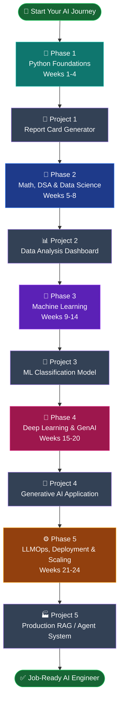
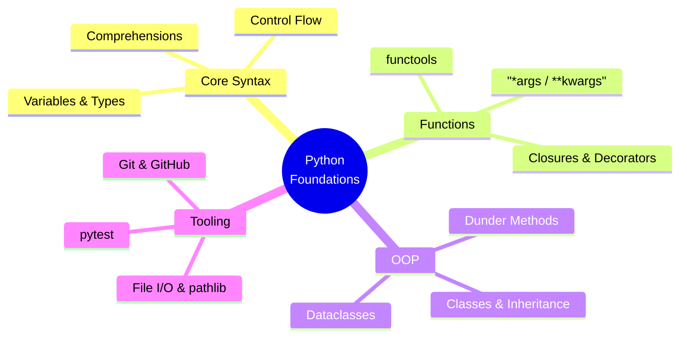
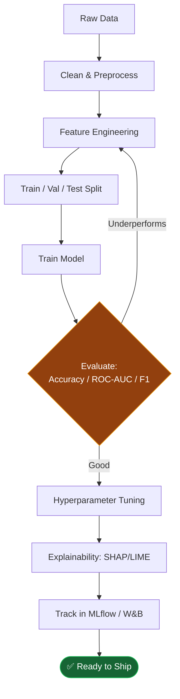
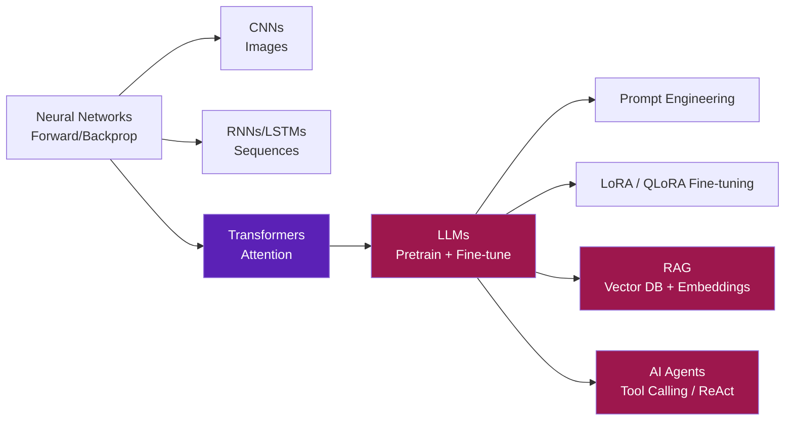
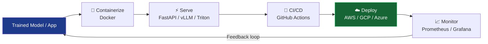

<p align="center">
  
</p>

<p align="center">
  
  
  
  
</p>

# 🚀 AI Engineer Roadmap — Zero to Expert

A complete, project-driven path from Python basics to a job-ready AI/ML Engineer — foundations, math, classical ML, deep learning, LLMs, AI agents, and production deployment.

> ⭐ Fork this repo, check off items as you go, and drop your project links in the `projects/` folder.

---

## 📌 Roadmap Overview



---

## 📅 Timeline at a Glance

```mermaid
gantt
    title 24-Week AI Engineer Roadmap
    dateFormat  X
    axisFormat Week %s
    section Foundations
    Python Foundations         :p1, 0, 4w
    section Core
    Math, DSA & Data Science   :p2, after p1, 4w
    Machine Learning           :p3, after p2, 6w
    section Advanced
    Deep Learning & GenAI      :p4, after p3, 6w
    LLMOps & Deployment        :p5, after p4, 4w
```



---

## 🐍 Phase 1 — Python Foundations (Weeks 1–4)

**Goal:** Write clean, idiomatic Python and understand what happens under the hood.



| Core | Expert Add-ons |
|---|---|
| Variables, data types, type hints | Async programming (`asyncio`) |
| Control flow, comprehensions, generators | Memory model, GIL, multiprocessing |
| Functions, `*args`/`**kwargs`, decorators | CLI tools with `argparse`/`click` |
| OOP: classes, inheritance, dataclasses, `abc` | Type checking with `mypy` |
| File I/O, error handling, context managers | — |
| `pytest`, fixtures, mocking | — |
| Git branching, PRs, commit hygiene | — |

**📦 Project 1 — Student Report Card Generator**
CLI/GUI app: ingest student scores (CSV/JSON) → compute grades/GPA → export PDF report cards. Include unit tests + README.

---

## 🔢 Phase 2 — Math, DSA & Data Science (Weeks 5–8)

**Goal:** Build the mathematical and computational intuition every ML engineer needs.

```mermaid
flowchart LR
    subgraph Math
    LA[Linear Algebra] --> SVD[Eigenvalues / SVD]
    Calc[Calculus] --> Grad[Gradients & Chain Rule]
    Stats[Probability & Stats] --> Bayes[Bayes / Hypothesis Testing]
    end
    subgraph DSA
    Arr[Arrays & Linked Lists] --> Sort[Sorting & Searching]
    Sort --> Tree[Trees & Graphs / BFS-DFS]
    end
    subgraph "Data Science"
    Np[NumPy] --> Pd[Pandas]
    Pd --> Viz[Matplotlib / Seaborn]
    Viz --> SQL[SQL: Joins, Window Fns]
    end

    style Math fill:#1e293b
    style DSA fill:#1e293b
    style "Data Science" fill:#1e293b
```

| Core | Expert Add-ons |
|---|---|
| Linear algebra: vectors, matrices, eigenvalues, SVD | Statistical significance & A/B testing |
| Calculus: derivatives, gradients, chain rule | Feature-scaling theory (the *why*, not just the *how*) |
| Probability & stats: distributions, Bayes, MLE | Linear regression implemented in raw NumPy |
| DSA: arrays, trees, graphs, sorting, Big-O | — |
| NumPy, Pandas, Matplotlib/Seaborn, EDA | — |
| SQL: joins, window functions, CTEs | — |

**📦 Project 2 — Data Analysis Dashboard**
End-to-end EDA + interactive dashboard (Streamlit/Plotly Dash) on a real Kaggle dataset. Include SQL queries, cleaning pipeline, insights write-up.

---

## 🤖 Phase 3 — Machine Learning (Weeks 9–14)

**Goal:** Understand ML theory deeply enough to debug models, not just call `.fit()`.



| Core | Expert Add-ons |
|---|---|
| Supervised: regression, decision trees, ensembles | Gradient boosting internals (XGBoost/LightGBM) |
| Unsupervised: k-means, PCA, t-SNE/UMAP | Explainability: SHAP, LIME |
| Feature engineering, encoding, SMOTE for imbalance | ML system design: train/serve skew, data leakage |
| Model evaluation: CV, ROC-AUC, confusion matrix | Drift detection |
| Hyperparameter tuning: grid/random/Optuna | Experiment tracking: MLflow, Weights & Biases |
| NLP basics: TF-IDF, Word2Vec, GloVe | — |
| Time series: ARIMA, seasonality | — |

**📦 Project 3 — ML Classification Model**
Full pipeline: EDA → feature engineering → model comparison (Logistic Regression vs XGBoost) → hyperparameter tuning → SHAP explainability → tracked experiments in MLflow.

---

## 🧠 Phase 4 — Deep Learning & Generative AI (Weeks 15–20)

**Goal:** Understand neural networks from first principles through modern LLMs.



| Core | Expert Add-ons |
|---|---|
| Neural nets: forward/backprop, activations, loss fns | Train a mini transformer from scratch |
| Optimizers: SGD, Adam, LR schedules | KV-caching, quantization (GPTQ, AWQ, GGUF) |
| Regularization: dropout, batch norm, early stopping | LLM evaluation: perplexity, LLM-as-judge |
| CNNs (ResNet, EfficientNet), RNNs/LSTMs/GRUs | Guardrails, hallucination mitigation, prompt-injection defense |
| Transformers: attention, positional encoding | — |
| Prompt engineering: zero-shot, few-shot, CoT | — |
| Fine-tuning: LoRA/QLoRA, PEFT | — |
| RAG: embeddings, FAISS/Pinecone/Chroma/Weaviate | — |
| AI Agents: LangChain, LangGraph, LlamaIndex, CrewAI | — |
| PyTorch, TensorFlow/Keras, HuggingFace | — |

**📦 Project 4 — Generative AI Application**
Build a RAG-powered chatbot or AI agent ("chat with your docs") using an open-source LLM, a vector DB, and a tool-calling agent loop. Deploy with Streamlit/Gradio.

---

## ⚙️ Phase 5 — LLMOps, Deployment & Scaling (Weeks 21–24) — *Expert Tier*

**Goal:** Ship AI systems that survive contact with real users and real traffic.



| Core | Expert Add-ons |
|---|---|
| Model serving: FastAPI, TorchServe, vLLM, Triton | Kubernetes basics, autoscaling for inference |
| Containerization: Docker, docker-compose | Cost optimization: batching, caching, quantization |
| CI/CD for ML: GitHub Actions | Security: API auth, rate limiting, PII handling |
| Monitoring: latency, drift, Prometheus/Grafana | MLOps lifecycle: DVC versioning, reproducibility |
| Cloud: AWS SageMaker / GCP Vertex AI / Azure ML | — |

**📦 Project 5 — Production-Grade AI Agent / RAG System**
Take Project 4 → containerize it → add CI/CD pipeline → deploy to cloud → add monitoring/logging → load-test it → document architecture with a diagram.

---

## ✅ Job-Ready / Expert AI Engineer — Checklist

- [ ] Python & DSA
- [ ] Math for ML (Linear Algebra, Calculus, Statistics)
- [ ] Data Science & SQL
- [ ] Classical Machine Learning
- [ ] Deep Learning (CNNs, RNNs, Transformers)
- [ ] LLMs, RAG & AI Agents
- [ ] Deployment, MLOps & Scaling
- [ ] 5 portfolio projects on GitHub with clean READMEs
- [ ] System design for ML interviews
- [ ] Contributions to at least 1 open-source ML/AI repo

---

## 📚 Suggested Resources

| Area | Resource |
|---|---|
| Python | *Fluent Python*, Corey Schafer YouTube |
| Math | *Mathematics for Machine Learning* (free PDF), 3Blue1Brown |
| ML | *Hands-On ML with Scikit-Learn, Keras & TensorFlow* — Aurélien Géron |
| DL | *Deep Learning* — Goodfellow et al., fast.ai course |
| Transformers/LLMs | Hugging Face NLP Course, Karpathy's "Let's build GPT" |
| MLOps | *Designing Machine Learning Systems* — Chip Huyen |
| Practice | Kaggle, LeetCode/NeetCode, Papers with Code |

---

## 🗂 Repo Structure

```
├── README.md
├── assets/
│   └── banner.svg
├── phase1-python/
├── phase2-math-dsa-datascience/
├── phase3-machine-learning/
├── phase4-deep-learning-genai/
├── phase5-llmops-deployment/
└── projects/
    ├── 01-report-card-generator/
    ├── 02-data-analysis-dashboard/
    ├── 03-ml-classification-model/
    ├── 04-genai-application/
    └── 05-production-rag-agent/
```

---

<p align="center">⭐ Star this repo if it helps you. PRs welcome for corrections and resource additions.</p>
