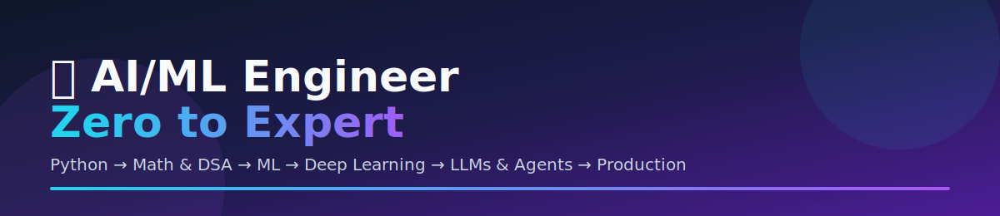
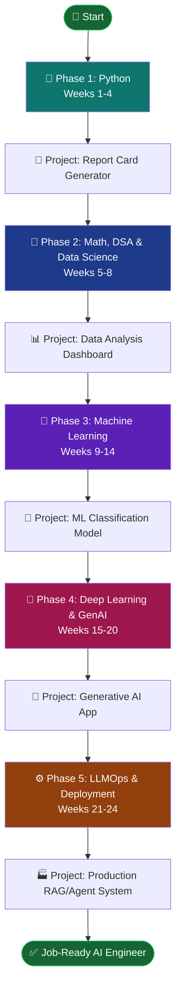
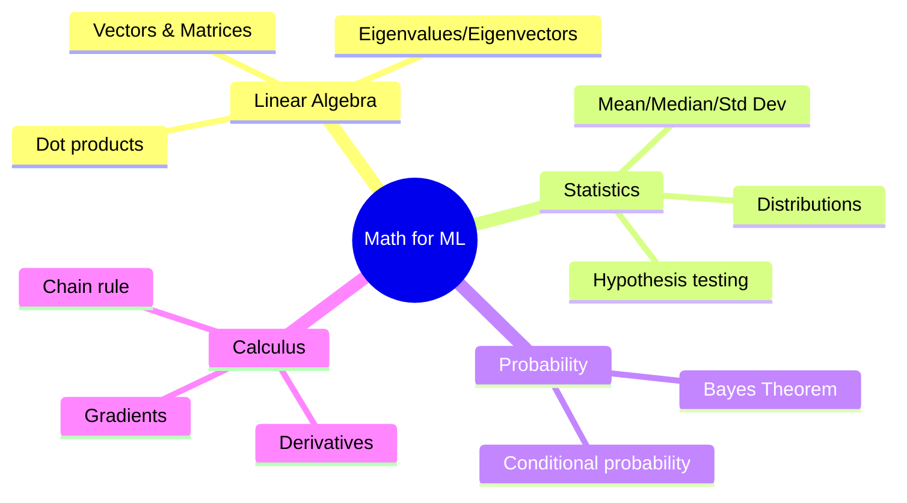
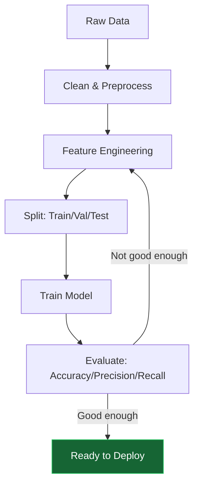
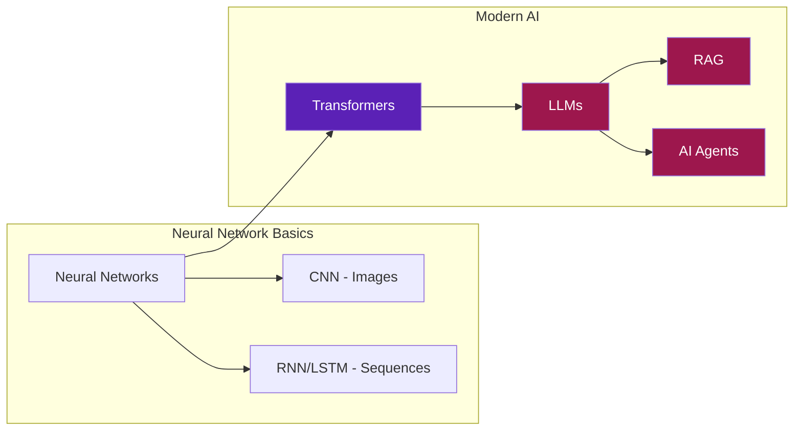
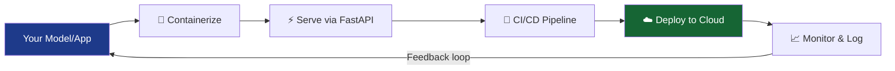

  

  
  
  
  
  

# 🚀 AI/ML Engineer Roadmap — Beginner to Expert

> Written from real daily learning experience — now leveled up with expert-track depth, diagrams, and a production-grade final phase.
> No fluff. Just the path that works. 🔥

---

## 👋 Who This Is For

- ✅ Complete beginner, zero coding background
- ✅ Confused about where to start
- ✅ Tried before, lost momentum, want a structured restart
- ✅ Wants to go all the way to **job-ready AI Engineer**, not just "know some ML"

---

## ❌ The Mistake vs ✅ The Right Path

**Don't skip steps — every phase builds on the previous one. Skipping math to "get to the fun part" is the #1 reason people plateau at intermediate level.**

---

## 🗺️ The Full Learning Path (Expert Track)

---

### 🐍 Phase 1 — Python Foundations (Weeks 1–4)

**Why:** Every AI/ML library — NumPy, PyTorch, HuggingFace — is Python. No Python, no AI/ML.

**Core:**
- Variables, data types, loops, recursion
- Data structures — lists, dicts, sets, tuples
- Functions, `*args`/`**kwargs`, decorators, closures
- OOP — classes, inheritance, encapsulation, dunder methods
- File handling, exception handling, context managers

**Expert add-ons (what separates you from tutorial-followers):**
- Type hints + `mypy` for catching bugs before runtime
- `asyncio` basics — needed later for serving AI apps
- Writing tests with `pytest`
- Git branching workflow + clean commit history (recruiters check this!)

**Resources:** [GeeksforGeeks Python](https://www.geeksforgeeks.org/python-programming-language/) · [W3Schools Python](https://www.w3schools.com/python/)

**Done when:** You can write a program from memory, no Googling syntax.

**📦 Project 1:** Student Report Card Generator (CLI, reads CSV, computes grades, exports PDF, has unit tests).

---

### 🔢 Phase 2 — Math, DSA & Data Science (Weeks 5–8)

**Why:** ML *is* math. Skip this and you'll memorize `.fit()` calls without knowing why a model fails.

**Core:**
- Arrays, searching, sorting, Big-O basics
- Statistics — mean, median, standard deviation, correlation
- Probability — Bayes' theorem, conditional probability
- Linear algebra — vectors, matrices, dot products
- NumPy, Pandas, Matplotlib/Seaborn

**Expert add-ons:**
- Eigenvalues/eigenvectors → why PCA works
- Gradient & chain rule → why backpropagation works
- SQL — joins, window functions, CTEs (most real data lives in databases, not CSVs)

**Resources:** [Khan Academy Statistics](https://www.khanacademy.org/math/statistics-probability) · [GeeksforGeeks DSA](https://www.geeksforgeeks.org/data-structures/)

**Done when:** You can look at a dataset and explain what the numbers *mean*, not just plot them.

**📦 Project 2:** Data Analysis Dashboard (EDA + SQL + interactive Streamlit dashboard on a real Kaggle dataset).

---

### 🤖 Phase 3 — Machine Learning (Weeks 9–14)

**Why:** This is where machines start "learning" patterns from data instead of following fixed rules.

**Core:**
- Supervised vs unsupervised learning
- Linear & logistic regression
- Decision trees, random forests
- Model evaluation — accuracy, precision, recall, F1, confusion matrix
- Scikit-learn

**Expert add-ons:**
- Gradient boosting: XGBoost/LightGBM (used in most real-world tabular ML)
- Cross-validation + hyperparameter tuning (GridSearch, Optuna)
- Explainability — SHAP values ("why did the model predict this?")
- Experiment tracking — MLflow or Weights & Biases (so your work is reproducible)

**Resources:** [Kaggle Learn ML](https://www.kaggle.com/learn/intro-to-machine-learning) · [Google ML Crash Course](https://developers.google.com/machine-learning/crash-course)

**Done when:** You can build, tune, evaluate, and explain a model on a real dataset — not just run one cell of code.

**📦 Project 3:** ML Classification Model (compare 2+ algorithms, tune hyperparameters, explain predictions with SHAP, track experiments).

---

### 🧠 Phase 4 — Deep Learning & Generative AI (Weeks 15–20)

**Why:** This is what powers ChatGPT, image generation, voice assistants — the "AI" everyone talks about today.

**Core:**
- Neural networks from scratch (forward pass, backprop, activation functions)
- TensorFlow/Keras and PyTorch
- CNNs for images, RNN/LSTM for sequences
- Transformers, attention mechanism
- HuggingFace ecosystem

**Expert add-ons:**
- Prompt engineering — zero-shot, few-shot, chain-of-thought
- Fine-tuning with LoRA/QLoRA (train big models on a normal GPU)
- **RAG (Retrieval-Augmented Generation)** — embeddings + vector databases (FAISS, Chroma, Pinecone)
- **AI Agents** — tool calling, ReAct pattern, frameworks like LangChain/LangGraph
- Model quantization basics — running big models efficiently

**Resources:** [fast.ai](https://www.fast.ai/) · [HuggingFace Course](https://huggingface.co/learn)

**Done when:** You can build and deploy a real AI application that talks to your own data.

**📦 Project 4:** Generative AI Application — a RAG chatbot or AI agent over your own documents, with a simple UI (Streamlit/Gradio).

---

### ⚙️ Phase 5 — LLMOps & Deployment (Weeks 21–24) — *This is what makes you "expert," not just "knowledgeable"*

Most tutorials stop at Phase 4. **Real AI Engineer jobs need this phase.**

**What to learn:**
- Serving models: FastAPI, vLLM
- Docker — containerize your app so it runs anywhere
- CI/CD basics — GitHub Actions to auto-test and deploy
- Monitoring — logging, latency tracking, catching model drift
- Cloud basics — deploy on AWS/GCP/Azure free tier
- Security — API keys, rate limiting, not leaking secrets in your repo

**Done when:** A stranger can call your deployed API and get a real response — not just "works on my laptop."

**📦 Project 5:** Take Project 4, containerize it with Docker, add a CI/CD pipeline, deploy it live, and add basic monitoring. Document the architecture with a diagram in your README.

---

## 💡 Tips That Actually Work

| Tip | Why It Works |
|---|---|
| 🗓️ **Code every single day** | Even 30 min beats 8-hour weekend cramming — consistency compounds |
| 🧠 **Write code from memory** | Struggling to recall is literally how the brain encodes learning |
| 📝 **Document everything publicly** | Public accountability keeps you consistent (this repo is proof) |
| 🛠️ **Build projects from Day 1** | Projects teach faster than tutorials — don't wait to "know enough" |
| 📢 **Learn in public** | Post progress on LinkedIn — community keeps you going on hard days |
| 📊 **Compare Day-N to your own Day-1** | Not to someone else's Day 500 — everyone starts at zero |

---

## 🛠️ Tools You Need

| Tool | Purpose | Cost |
|---|---|---|
| [Python](https://www.python.org/) | Programming language | Free |
| [VS Code](https://code.visualstudio.com/) | Code editor | Free |
| [Google Colab](https://colab.research.google.com/) | Notebooks with free GPU | Free |
| [GitHub](https://github.com/) | Store & showcase your code | Free |
| [Kaggle](https://www.kaggle.com/) | Datasets & competitions | Free |
| [Hugging Face](https://huggingface.co/) | Pretrained models & datasets | Free |
| [MLflow](https://mlflow.org/) | Experiment tracking | Free |
| [Docker](https://www.docker.com/) | Containerize your apps | Free |

**Total cost: ₹0 — everything here is free.** 🎉

---

## 📅 Realistic Timeline

```mermaid
gantt
    title AI/ML Engineer Roadmap Timeline
    dateFormat  X
    axisFormat %s
    section Phase 1
    Python Foundations       :p1, 0, 4w
    section Phase 2
    Math, DSA & Data Science :p2, after p1, 4w
    section Phase 3
    Machine Learning         :p3, after p2, 6w
    section Phase 4
    Deep Learning & GenAI    :p4, after p3, 6w
    section Phase 5
    LLMOps & Deployment      :p5, after p4, 4w
```

| Phase | Duration | Outcome |
|---|---|---|
| Python Foundations | 4 weeks | Write clean Python code |
| Math & DSA | 4 weeks | Understand data & algorithms |
| Machine Learning | 6 weeks | Build & evaluate ML models |
| Deep Learning & GenAI | 6 weeks | Build real AI applications |
| LLMOps & Deployment | 4 weeks | Ship production-ready AI |
| **Total** | **~6 months** | **Job-ready AI Engineer** |

---

## 🎯 Your First Week Action Plan

| Day | Task |
|---|---|
| 1 | Install Python + VS Code, write Hello World |
| 2 | Learn variables & data types |
| 3 | Learn conditions & loops |
| 4 | Learn functions |
| 5 | Build first mini project |
| 6 | Review & practice everything |
| 7 | Rest, plan next week |

---

## ✅ Expert-Level Checklist

- [ ] Python & DSA
- [ ] Math for ML (Linear Algebra, Calculus, Statistics)
- [ ] SQL + Data Analysis
- [ ] Classical ML (regression, trees, boosting)
- [ ] Model evaluation & explainability (SHAP)
- [ ] Deep Learning (CNN, RNN, Transformers)
- [ ] LLMs, RAG & AI Agents
- [ ] Docker, CI/CD, cloud deployment
- [ ] Monitoring & MLOps basics
- [ ] 5 portfolio projects with clean READMEs

---

## 🔗 Follow My Journey

I'm documenting every single day of this journey publicly.

- 📅 [Daily Progress](README.md)
- 📊 [Full Roadmap](progress-tracker.md)
- 📚 [Resources](resources/useful-links.md)
- 💻 [All Code](days/)

---

## 💬 Connect & Learn Together

---

<i>You don't have to be great to start. But you have to start to be great. 🔥</i>

<b>— Balaravi, AI Engineer Journey</b>

