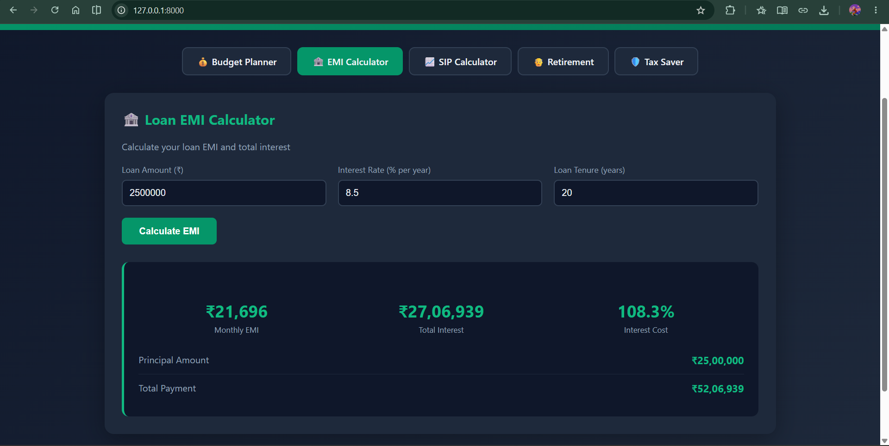
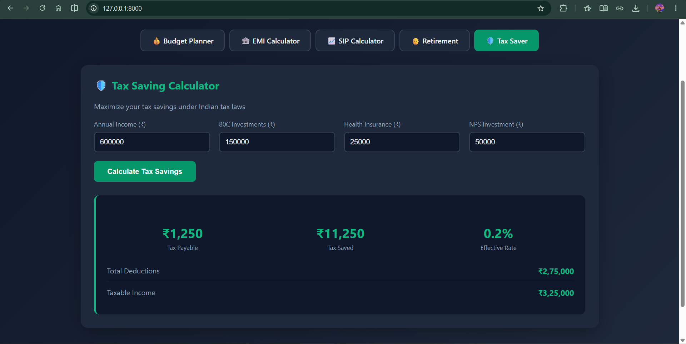

# 🏦 ArthAI — Smart Financial Advisor for Every Indian

> AI-powered personal finance management system
> Built during Day 29+ of my AI/ML learning journey

---

## 🎯 Problem Statement

99% of Indians don't have access to a personal
financial advisor. ArthAI changes that!

Whether you earn ₹15,000 or ₹1,50,000 —
ArthAI gives you professional financial guidance
completely FREE!

---

## 🚀 Features

| Module | What It Does |
|--------|-------------|
| 💰 Budget Planner | Smart budget based on your income |
| 📈 SIP Calculator | Find minimum SIP for your goals |
| 🏦 EMI Calculator | Calculate and optimize loan EMIs |
| 🛡️ Tax Saver | Maximize your 80C and other deductions |
| 🎯 Goal Planner | Plan for house, car, education |
| 👴 Retirement Planner | Calculate retirement corpus |
| 📊 Portfolio Analyzer | Analyze investment performance |

---

## 🛠️ Tech Stack
Backend  → Python + FastAPI

Calc     → DSA algorithms (DP, Binary Search)

Frontend → HTML + CSS + JavaScript

Charts   → Plotly

Deploy   → Render(free!)
---

## 🔥 Why ArthAI is Different

- ✅ India-specific (₹, 80C, NPS, PPF, ELSS)
- ✅ Works for ANY income level
- ✅ AI-powered recommendations
- ✅ All modules in ONE place
- ✅ Free forever

---

## 🏗️ Build Status

- [x] Core financial calculations
- [x] Budget Planner
- [x] EMI Calculator
- [x] SIP Calculator
- [ ] Tax Saver (coming soon)
- [ ] Goal Planner (coming soon)
- [ ] Retirement Planner (coming soon)
- [ ] AI Chatbot (coming soon)
- [ ] Web Interface (coming soon)

---
## 📸 Screenshots

### Smart Budget Planner

*AI-generated budget based on 50/30/20 rule customized for Indian income levels*

### EMI Calculator

*Complete loan analysis with amortization schedule*

### SIP Investment Planner

*Binary search algorithm finds minimum SIP needed for any goal*

### Retirement Planner

*Inflation-adjusted retirement corpus calculation*

### Tax Saving Calculator

*India-specific tax optimization under 80C, 80D, NPS*

---


## 💻 Run Locally

```bash
git clone https://github.com/balaravi444/AI-ML-Learning-Journey
cd projects/arthAI
pip install -r requirements.txt
uvicorn app:app --reload
```

Visit `http://localhost:8000`

*Built by Balaravi — Day 29 of AI/ML Journey*
*github.com/balaravi444/AI-ML-Learning-Journey*

