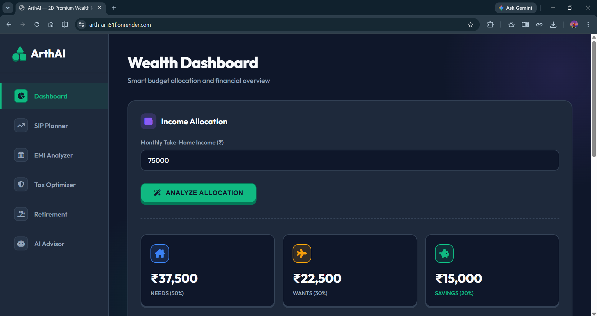
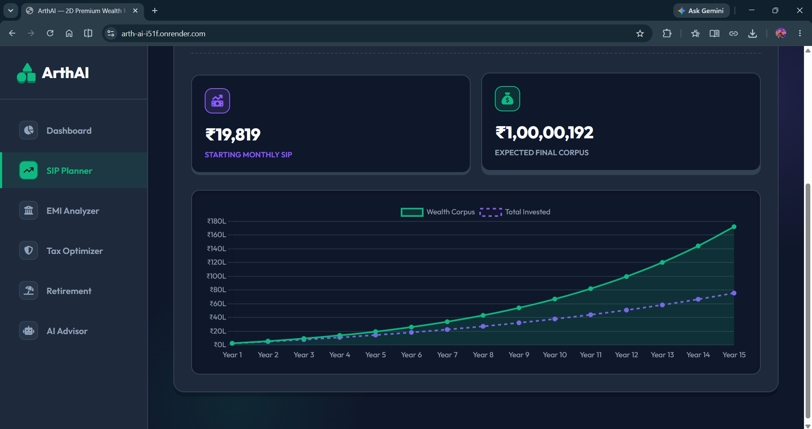
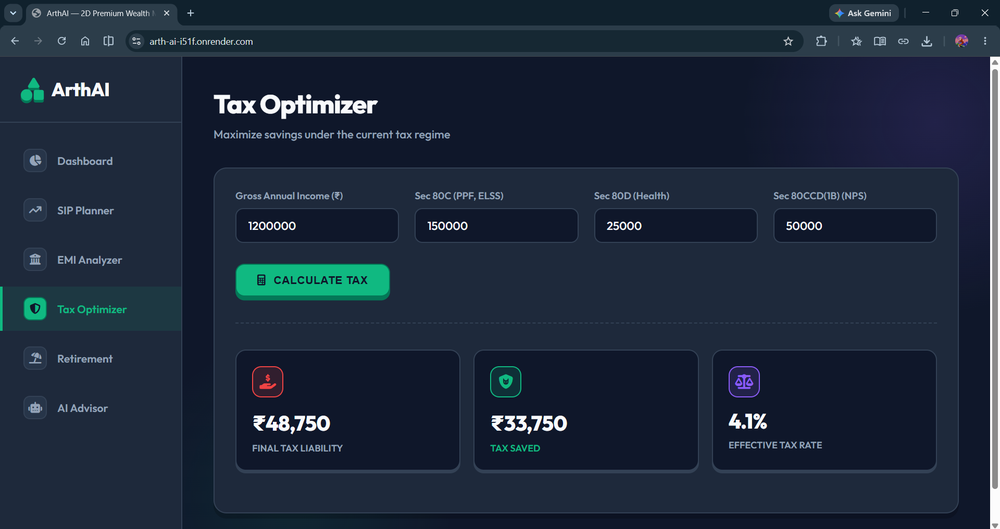
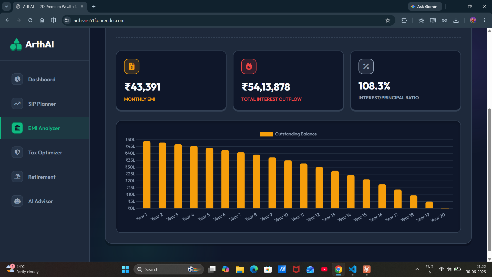
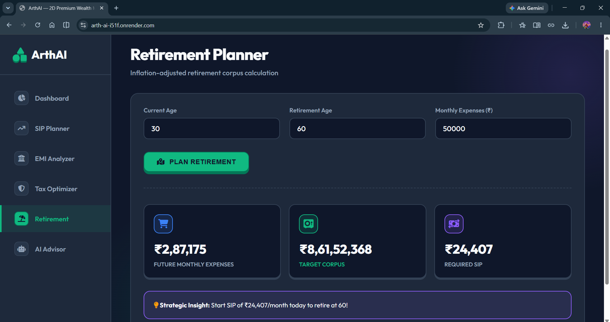

# 🏦 ArthAI — Smart Financial Advisor for Every Indian

> AI-powered personal finance management system
> Built during Day 29-34 of my 90-day AI/ML learning journey


---

## 🎯 Problem Statement

99% of Indians don't have access to a personal financial advisor.
ArthAI changes that — professional financial guidance for EVERYONE,
completely FREE, from ₹15,000 salary to ₹1,50,000 salary.

---

## 🚀 Live Demo

👉 **[Try ArthAI Live](https://arth-ai-i51f.onrender.com)** 

---

## ✨ Features

| Module | What It Does | DSA/Algorithm Used |
|--------|-------------|-------------------|
| 💰 Budget Planner | Smart 50/30/20 budget | Greedy Algorithm |
| 🏦 EMI Calculator | Full loan amortization | Dynamic Programming |
| 📈 SIP Calculator | Find minimum monthly SIP | Binary Search |
| 🛡️ Tax Saver | 80C, 80D, NPS optimization | India-specific slabs |
| 👴 Retirement Planner | Inflation-adjusted corpus | Compound interest |
| 🎯 Goal Optimizer | Multi-goal allocation | 0/1 Knapsack DP |
| 📊 Portfolio Tracker | Risk + diversification | Shannon Entropy |
| 🤖 AI Chatbot | Financial Q&A | Gemini LLM + RAG |
| 📄 PDF Reports | Downloadable summary | ReportLab |

---

## 🔥 Why ArthAI is Different

- ✅ **India-specific** — ₹, 80C, NPS, PPF, ELSS, Sukanya Samriddhi
- ✅ **Works for ANY income** — ₹15,000 to ₹1,50,000/month
- ✅ **Real DSA algorithms** — not just calculators
- ✅ **AI-powered** — Gemini LLM for personalized advice
- ✅ **All-in-one** — 9 features in one dashboard
- ✅ **Free forever** — no subscription

---

## 🛠️ Tech Stack

```
Backend   → Python + FastAPI
AI        → Google Gemini 1.5 Flash API
Frontend  → HTML + CSS + Vanilla JavaScript
PDF       → ReportLab
Deploy    → Render (free tier)
```

---

## 📁 Project Structure

```
arthAI/
├── app.py                      # FastAPI main application
├── requirements.txt            # Python dependencies
├── render.yaml                 # Deployment config
├── .env.example               # Environment variables template
├── .gitignore
├── modules/
│   ├── __init__.py
│   ├── financial_utils.py     # Core calculations (Binary Search, DP)
│   ├── goal_planner.py        # Knapsack DP goal optimizer
│   ├── portfolio_tracker.py   # Shannon Entropy diversification
│   ├── ai_advisor.py          # Gemini LLM chatbot
│   └── report_generator.py    # PDF report generator
├── templates/
│   └── index.html             # Complete web dashboard
└── static/                    # CSS/JS assets (if any)
```

---

## 🚀 Run Locally

```bash
# 1. Clone the repo
git clone https://github.com/balaravi444/AI-ML-Learning-Journey
cd projects/arthAI

# 2. Install dependencies
pip install -r requirements.txt

# 3. Set up API key
cp .env.example .env
# Edit .env and add your Gemini API key

# 4. Run the app
uvicorn app:app --reload

# 5. Open browser
# Go to http://localhost:8000
```

---

## 🔑 Get Free Gemini API Key

1. Go to **[aistudio.google.com](https://aistudio.google.com)**
2. Sign in with Google account
3. Click **"Get API Key"**
4. Copy key to your `.env` file

---

## 🌐 Deploy to Render (Free)

1. Push to GitHub
2. Go to **[render.com](https://render.com)** → New Web Service
3. Connect your GitHub repo
4. Set **Root Directory:** `projects/arthAI`
5. Build: `pip install -r requirements.txt`
6. Start: `uvicorn app:app --host 0.0.0.0 --port $PORT`
7. Add `GEMINI_API_KEY` in Environment Variables
8. Deploy! 🎉

---

## 🧮 DSA Algorithms Inside

### Binary Search — SIP Calculator
```python
def find_minimum_sip(target, rate, years):
    left, right = 100, 1_000_000
    while left < right:
        mid = (left + right) // 2
        if calculate_corpus(mid) >= target:
            right = mid
        else:
            left = mid + 1
    return left
```

### 0/1 Knapsack DP — Goal Optimizer
```python
# goals = items, priority = value
# monthly_required = weight, savings = capacity
dp[i][w] = max(dp[i-1][w],
               dp[i-1][w-weight] + value)
```

### Shannon Entropy — Portfolio Diversification
```python
# Same formula as Decision Tree information gain!
entropy = -sum(w * log2(w) for w in weights if w > 0)
```

---

## 📸 Screenshots

## Screenshots

### Home


### SIP Planner


### Tax Planner


### EMI Analyzer


### Retirement Planner


---

## 💡 What I Learned Building This

- FastAPI for production Python web apps
- Prompt engineering for domain-specific LLMs
- Binary Search applied to real optimization problems
- Knapsack DP for resource allocation
- Shannon Entropy connects finance and ML math
- Deploying Python apps to production

---

## 🗺️ Roadmap

- [x] Budget Planner
- [x] EMI Calculator
- [x] SIP Calculator
- [x] Tax Saving Calculator
- [x] Retirement Planner
- [x] Goal Optimizer
- [x] Portfolio Tracker
- [x] AI Chatbot
- [x] PDF Reports
- [ ] User accounts + data persistence
- [ ] Real-time stock/mutual fund data
- [ ] Mobile app
- [ ] Multi-language (Hindi support)

---

## 👨‍💻 Author

**Bala Ravi** — BCA Student, The Oxford College of Science, Bangalore
- 🐙 GitHub: [balaravi444](https://github.com/balaravi444)
- 💼 LinkedIn: [bala-ravi444](https://linkedin.com/in/bala-ravi444)
- 🐦 Twitter: [@balaravi444](https://twitter.com/balaravi444)

---

## ⚠️ Disclaimer

ArthAI provides general financial guidance for educational purposes.
Always consult a SEBI registered financial advisor for personalized advice.

---

*Built during Day 29-34 of my 90-day AI/ML Learning Journey 🚀*
